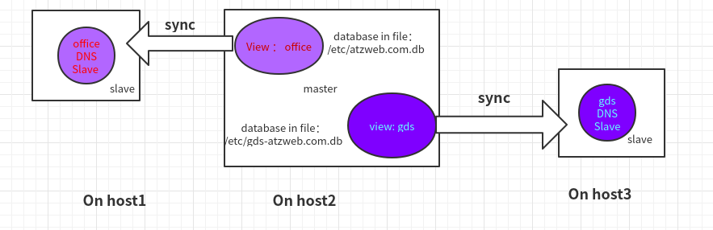

## 需求
- 主从同步
- 不同的客户端，解析相同的域名，要得到不同的IP地址（使用view实现）

## 框架图概览：



## On Master(host2) configuration：
1.  filename：/etc/name.conf

- all zone should put in views, so comment  the zone configs and added to /etc/named.conf.local;

```
options {
	listen-on port 53 { any; };
	listen-on-v6 port 53 { any; };
	directory 	"/var/named";
	dump-file 	"/var/named/data/cache_dump.db";
	statistics-file "/var/named/data/named_stats.txt";
	memstatistics-file "/var/named/data/named_mem_stats.txt";
	allow-query     { any; };
	allow-transfer  { 10.1.32.9;10.1.93.253; };
	allow-recursion { any; };
        clients-per-query 0;
	// disable-empty-zone "10.IN-ADDR.ARPA." ;
        max-clients-per-query 0;

	forwarders {
		114.114.114.114;
		114.114.115.115;
		223.6.6.6;
		223.5.5.5;
	};

	/* 
	 - If you are building an AUTHORITATIVE DNS server, do NOT enable recursion.
	 - If you are building a RECURSIVE (caching) DNS server, you need to enable 
	   recursion. 
	 - If your recursive DNS server has a public IP address, you MUST enable access 
	   control to limit queries to your legitimate users. Failing to do so will
	   cause your server to become part of large scale DNS amplification 
	   attacks. Implementing BCP38 within your network would greatly
	   reduce such attack surface 
	*/
	recursion yes;

	dnssec-enable no;
	dnssec-validation no;
	dnssec-lookaside auto;

	/* Path to ISC DLV key */
	bindkeys-file "/etc/named.iscdlv.key";

	managed-keys-directory "/var/named/dynamic";

	pid-file "/run/named/named.pid";
	session-keyfile "/run/named/session.key";
};

logging {
        channel default_debug {
                file "data/named.run";
                severity dynamic;
        };
};
/*        zone "." IN {
                type hint;
                file "named.ca";
        };


*/
statistics-channels {
  inet 0.0.0.0 port 8053;
};

include "/etc/named.conf.local";
#include "/etc/named.rfc1912.zones";
include "/etc/named.root.key";
```

2. filename:/etc/named.conf.local
- two acl to defined different clients
- each view has one databasefile to resolve hosts
- each view notify to different slave

```
acl "gds_lan" { 10.1.93.0/24;};
acl "office" {!gds_lan;any;};
view "office" {
	match-clients {office;};
	zone "." IN {
        	type hint;
        	file "named.ca";
	};

	zone "atzweb.com" {
		type master;
		notify yes;
		also-notify { 10.1.32.9; };
	        file "/etc/atzweb.com.db";
	};
	
	
	zone "1.10.in-addr.arpa" {
		type master;
		notify yes;
		also-notify { 10.1.32.9; };
	        file "/var/named/db.10.1";
	};
	
	zone "ops.mds-trading.com" {
		type master;
		notify yes;
		also-notify { 10.1.32.9; };
	        file "/etc/ops.mds-trading.com.db";
	};
	
	zone "mds-trading.cn" {
		type master;
		notify yes;
		also-notify { 10.1.32.9; };
	        file "/etc/mds-trading.cn.db";
	};
	
	zone "localhost.localdomain" IN {
	        type master;
	        file "named.localhost";
	        allow-update { none; };
	};
	
	zone "localhost" IN {
	        type master;
	        file "named.localhost";
	        allow-update { none; };
	};
	
	zone "1.0.0.0.0.0.0.0.0.0.0.0.0.0.0.0.0.0.0.0.0.0.0.0.0.0.0.0.0.0.0.0.ip6.arpa" IN {
	        type master;
	        file "named.loopback";
	        allow-update { none; };
	};
	
	zone "1.0.0.127.in-addr.arpa" IN {
	        type master;
	        file "named.loopback";
	        allow-update { none; };
	};
	
	zone "0.in-addr.arpa" IN {
	        type master; 
	        file "named.empty";
	        allow-update { none; };
	};
};

view "gds" {
        match-clients {gds_lan;};
	zone "." IN {
                type hint;
                file "named.ca";
        };
  
        zone "atzweb.com" IN {
                type master;
                notify yes;
                also-notify { 10.1.93.253; };
                file "/etc/gds-atzweb.com.db";
        };


        zone "localhost.localdomain" IN {
                type master;
                file "named.localhost";
                allow-update { none; };
        };

        zone "localhost" IN {
                type master;
                file "named.localhost";
                allow-update { none; };
        };

        zone "1.0.0.0.0.0.0.0.0.0.0.0.0.0.0.0.0.0.0.0.0.0.0.0.0.0.0.0.0.0.0.0.ip6.arpa" IN {
                type master;
                file "named.loopback";
                allow-update { none; };
        };

        zone "1.0.0.127.in-addr.arpa" IN {
                type master;
                file "named.loopback";
                allow-update { none; };
        };

        zone "0.in-addr.arpa" IN {
                type master;
                file "named.empty";
                allow-update { none; };
        };


};
```

## on slave (host1 and host3)server
- cat /etc/named.conf

```
options {
	listen-on port 53 { 127.0.0.1;any; };
	listen-on-v6 port 53 { ::1;any; };
	directory 	"/var/named";
	dump-file 	"/var/named/data/cache_dump.db";
	statistics-file "/var/named/data/named_stats.txt";
	memstatistics-file "/var/named/data/named_mem_stats.txt";
	recursing-file  "/var/named/data/named.recursing";
	secroots-file   "/var/named/data/named.secroots";
	allow-query     { localhost;any; };

	forwarders {
                114.114.114.114;
                114.114.115.115;
                223.6.6.6;
                223.5.5.5;
        };


	/* 
	 - If you are building an AUTHORITATIVE DNS server, do NOT enable recursion.
	 - If you are building a RECURSIVE (caching) DNS server, you need to enable 
	   recursion. 
	 - If your recursive DNS server has a public IP address, you MUST enable access 
	   control to limit queries to your legitimate users. Failing to do so will
	   cause your server to become part of large scale DNS amplification 
	   attacks. Implementing BCP38 within your network would greatly
	   reduce such attack surface 
	*/
	recursion yes;

	dnssec-enable yes;
	dnssec-validation yes;

	/* Path to ISC DLV key */
	bindkeys-file "/etc/named.iscdlv.key";

	managed-keys-directory "/var/named/dynamic";

	pid-file "/run/named/named.pid";
	session-keyfile "/run/named/session.key";
};

logging {
        channel default_debug {
                file "data/named.run";
                severity dynamic;
        };
};

zone "." IN {
	type hint;
	file "named.ca";
};

zone "atzweb.com" IN {
	type slave;
	masters { 10.1.32.10; };
	allow-transfer {10.1.32.10;};
	file "slaves/atzweb.com.db";
};

include "/etc/named.rfc1912.zones";
include "/etc/named.root.key";
```

## 参考文档
[kb.isc.org](https://kb.isc.org/docs/aa-00851)