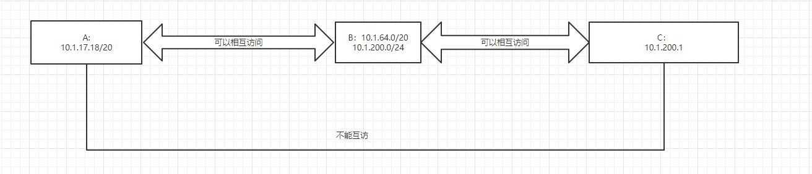
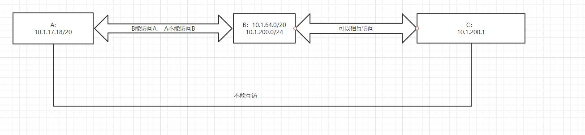
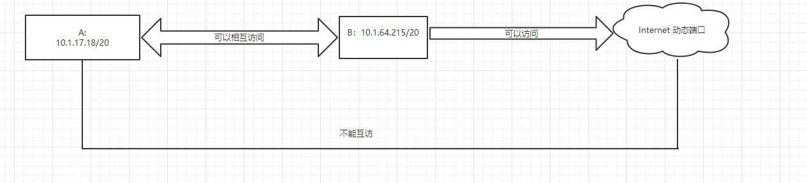

## autossh configuration

### parameters

|编号| 	参数| 	含义说明
|---|---|---
|1 	|-M |	用于有问题时就会自动重连；服务器 echo 机制使用的端口
|2 	|-D |	本地机器动态的应用程序端口转发
|3 	|-R |	将远程主机(服务器)的某个端口转发到本地端指定机器的指定端口
|4 	|-L |	将本地机(客户机)的某个端口转发到远端指定机器的指定端口
|5 	|-f |	后台运行
|6 	|-T |	不占用 shell
|7 	|-n |	配合 -f 参数使用
|8 	|-N |	不执行远程命令
|9 |-q |	安静模式运行；忽略提示和错误

### case1


- on hostA
```
autossh -M3390 -NfL 2222(port on hosta):10.1.200.1(target host c):22(target port of hostc)  10.1.64.215(Forward server B )
```

### case2


- on host B(forward server)
```
autossh -M3990 -NfR 2222(port on hosta):10.1.200.1(target host c):22(target port of hostc) 10.1.17.18(hosta)
```

### case3


- on host a
```
autossh -M3890 -D 1080 10.1.64.215
```